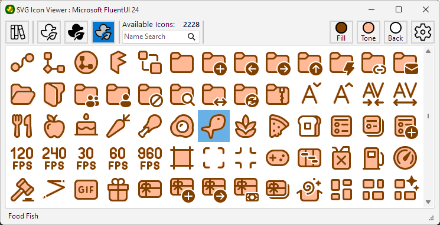

# SVGIconViewer

A simple windows based viewer containing over 27,450 individual SVG icons with the ability to copy
and export individual icons for use in other projects.  Two-tone ability was added
to render icons using both the outline and filled versions where there is a match.

Exporting to PNG will optionally create additional scaled versions ready to be imported
into a Delphi image collection.

This project includes icons from the [Microsoft fluent UI System Icons](https://github.com/microsoft/fluentui-system-icons)
and the [tabler-icons](https://github.com/tabler/tabler-icons) public repositories. Please see the appopriate library
for copyright and license information.
