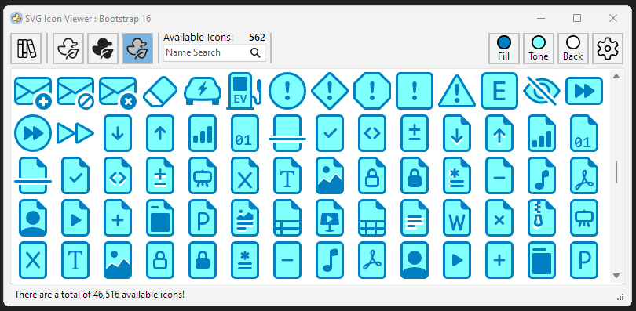

# SVGIconViewer v1.2

A simple windows based viewer containing over 46,500 individual SVG icons with the ability to copy
and export individual icons for use in other projects.  Two-tone ability was added
to render icons using both the outline and filled versions where there is a match.

Exporting to PNG will optionally create additional scaled versions ready to be imported
into a Delphi image collection.

Specifying a user folder will allow the system to create a TImageCollection component, allowing
quick pasting into your project as converted PNG files.

This project includes icons from the [Microsoft fluent UI System Icons](https://github.com/microsoft/fluentui-system-icons),
the [tabler-icons](https://github.com/tabler/tabler-icons) and [Bootstrap Icons](https://github.com/twbs/icons) public repositories. Please see the appopriate library
for copyright and license information (currently all are MIT licensed).

## Support

If you find SvgIconViewer useful, please give it a star.

Your support is greatly appreciated!

You can also support my work by buying me a coffee.

## Installation

You can either download the source and compile using Delphi 12.0 or greater, OR download the latest [release](https://github.com/skamradt/SVGIconViewer/releases) zip file
and extract all contents to the location of your choosing.

## Usage

The Icons along the top are
 
| icon | description |
| :---: | :--- |
|  |When pressed with the mouse will display the list of collections available in the library.|
|  | When pressed will show the outlined icon subset in the collection. This is the only option available for the `user specified folder` option. |
|  | When pressed will show the filled icon subset in the collection |
|  | When pressed will show the generated twotone icon subset in the collection based on icons which match in name in both the outline and filled subsets. |
| Fill, Tone, Back | These buttons, when pressed will allow selecting the color for the appropriate section. Fill is either the stroke color for outline/twotone and the fill color for solid icons. Tone is the fill color for solid icons rendered in twotone mode.  Back is the UI background color and is not stored in the SVG or PNG which will have a transparent background. |
|  | Only available when a user directory is selected from the library.  This button will generate a TImageCollection containing all images in the current directory as PNG files with the size specified from the config screen. |
|  | When pressed will display some options available to the program. |

## Contributing

Contributions are welcome!
If you have suggestions for improvements or find any issues, please open an issue or submit a pull request.

## License

This project is licensed under the MIT License.
See the LICENSE file for details.

## Dependencies

This project makes use of the [TControlList](https://docwiki.embarcadero.com/RADStudio/Athens/en/10.4_Sydney_-_Release_2#New_VCL_TControlList_Control)
component released in Delphi 10.4.2 as well as the [Skia4Delphi](https://docwiki.embarcadero.com/RADStudio/Athens/en/Skia4Delphi) released with Delphi 12.
Because the program makes heavy use of multi-line string constants, the project requires Delphi 12.0 or better to build.

## Release History

September 23, 2024 - 1.2.2
* Restored default Windows style to the project to eliminate another dependency
* Corrected various hints/warnings
* Updated to better display the toolbar in high DPI modes
* Updated license text to match standard

September 21, 2024 - 1.2.1
* Updated generation to properly categorize a few filled bootstrap icons that were showing in the outline list.
* Corrected issues where a few bootstrap icons were missing or did not align properly when rendered as Two Tone. This adds 118 icons to the bootstrap Two Tone list.
* Changing to a different icon list will now clear the icon selection.

September 19, 2024 - 1.2
* Replaced toolbar panels with TControlLists for a better UI experience.
* Removed duplicate solid filled icons from the tabler-icons alternate strokes collections.
* Removed reference to the spring library. It is no longer used to reduce dependencies.
* Added count of icons at startup. This count does not include icons in the user specified folder.
* Added the bootstrap icon library

September 18, 2024 - 1.1
* Added ability to specify an additional user directory containing SVG files that will be loaded into the library collections for viewing and exporting.
These icons will be displayed as is and `fill` color replacement will be performed on any "currentColor" color settings globally to the icon.
* Added confirmation message when saving an SVG or PNG to a location where that filename already exists.
* Added ability to create a TImageCollection from all images in the currently selected user folder.

September 16, 2024 - 1.0
* Initial release

